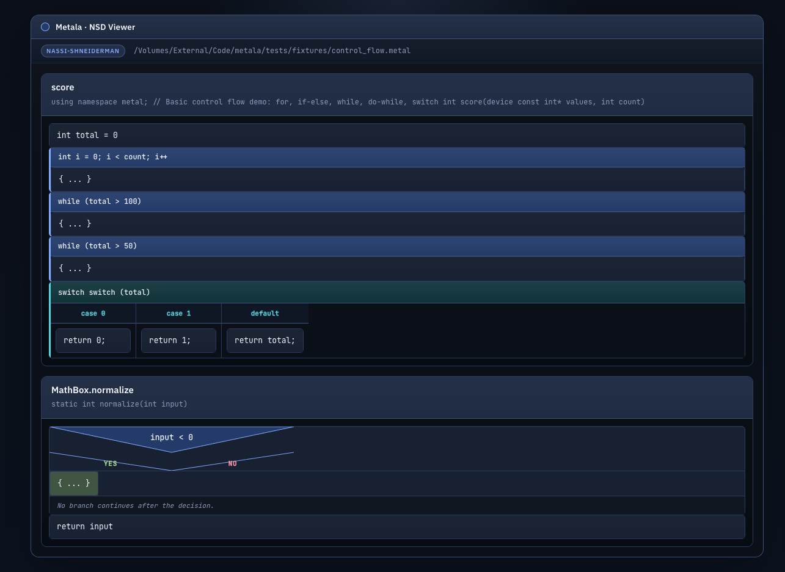
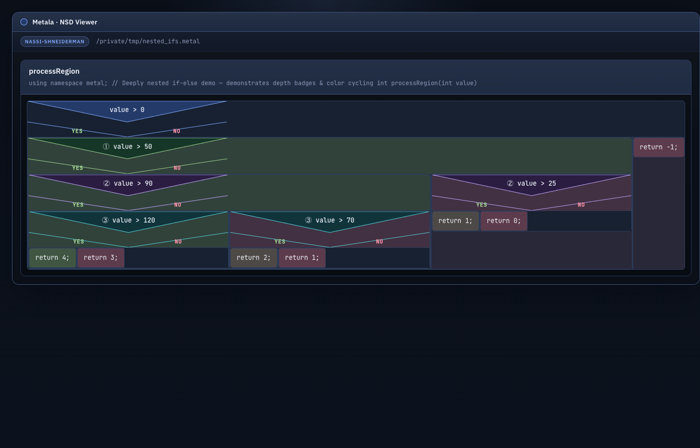

# metala

Metala is a simple, scalable monolith for parsing Metal Shading Language (MSL) source code through ANTLR while keeping the architecture clean enough for future semantic analysis, indexing, and export pipelines.

The project starts from the domain, not from the framework:

* business goal: convert MSL source into a stable structural model for downstream tooling
* architectural style: DDD-inspired layered monolith with hexagonal boundaries
* parser engine: ANTLR4 with a Metal Shading Language grammar targeting MSL 2.x, plus a reproducible Python-compatibility patch step
* current delivery channel: CLI that parses a file or a directory and returns versioned JSON

## What the system does

Today the system supports:

* **Parsing Metal code**
  * parsing one Metal file
  * parsing a directory of Metal files
  * extracting a lightweight structural model: imports, type declarations, functions, variables, and extensions
  * reporting syntax diagnostics as part of the contract

* **Control flow extraction**
  * if/else statements with nested branches
  * guard statements
  * while loops
  * for-in loops
  * repeat-while loops
  * switch/case statements
  * do-catch blocks
  * defer blocks
  * trailing closure expansion (`.map{}`, `.forEach{}`, `.reduce{}`)

* **Nassi-Shneiderman diagrams**
  * building a Nassi-Shneiderman HTML diagram for one Metal file
  * building diagram bundles for entire directories with index page
  * classic NS rendering with SVG triangles for if-blocks
  * depth-coded nested ifs (up to 50 levels with color cycling and Unicode badges ①-㊿)
  * classic case block structure with side-by-side columns
  * dark Tokyo Night-inspired theme with JetBrains Mono font
  * proper text wrapping and responsive layout

* **Code smell detection**
  * static analysis of one Metal file or entire directories
  * 34 smell kinds across two categories: Fowler classics and GPU-specific patterns
  * markdown (default) or JSON output to stdout
  * self-contained dark-themed HTML reports via `--out`
  * configurable thresholds (threadgroup limits, GPU identifier names, etc.)

* **Architecture**
  * keeping parser infrastructure behind ports so the application layer stays independent from ANTLR, filesystem, and CLI details

## Diagram Features

The Nassi-Shneiderman diagrams include:

* **Visual clarity**
  * Classic NS triangles for if-blocks with Yes/No labels
  * Horizontal dividers for case blocks with side-by-side columns
  * Color-coded block types (loops=blue, guards=orange, switches=teal, etc.)
  * JetBrains Mono monospace font for code readability

* **Depth awareness**
  * 50 depth levels with cycling colors (blue → green → purple → teal → amber)
  * Unicode circled badges (①-⑩, ⑪-⑳, ㉑-㉟, ㊱-㊿) on nested conditionals
  * Background tinting for deeper nesting levels

* **Dark theme**
  * Tokyo Night-inspired color palette optimized for code readability
   * Proper contrast ratios for comfortable viewing
   * Responsive layout for different screen sizes

* **Smart parsing**
   * Trailing closure expansion for functional chains
   * Fast path for simple function bodies

### Screenshots

**Basic control flow** — for-in, if/else, while, do-while, switch/case on `score()`:



**Nested conditionals** — depth-coded badges and cycling colours for 6 levels of nesting:



## Architecture

The codebase is split into four explicit layers:

* `domain`: domain model, invariants, ports, and domain events
* `application`: use cases and DTOs
* `infrastructure`: ANTLR adapter, filesystem adapters, event publishing
* `presentation`: CLI contract

See the full design docs in [docs/domain-and-goals.md](docs/domain-and-goals.md), [docs/requirements.md](docs/requirements.md), [docs/system-context.md](docs/system-context.md), [docs/glossary.md](docs/glossary.md), and [docs/architecture.md](docs/architecture.md).

## Quick Start

1. Install dependencies:

```bash
uv sync --extra dev
```

2. Generate the Metal parser from the vendored grammar:

```bash
uv run python scripts/generate_metal_parser.py
```

3. Parse a single file:

```bash
uv run metala parse-file path/to/File.metal
```

4. Parse a directory:

```bash
uv run metala parse-dir path/to/project
```

5. Build a Nassi-Shneiderman diagram for a Metal file:

```bash
uv run metala nassi-file path/to/Algorithms.metal --out output/algorithms.nassi.html
```

6. Build Nassi-Shneiderman diagrams for an entire directory:

```bash
uv run metala nassi-dir path/to/project --out output/nassi-bundle
```

7. Detect code smells in a single Metal file:

```bash
uv run metala smells-file path/to/File.metal
```

Output formats:

```bash
# JSON for tooling integration
uv run metala smells-file path/to/File.metal --format json

# HTML report (dark theme, self-contained)
uv run metala smells-file path/to/File.metal --out report.smells.html
```

8. Detect code smells across an entire project:

```bash
# Markdown summary (default)
uv run metala smells-dir path/to/project

# JSON with per-file breakdowns
uv run metala smells-dir path/to/project --format json

# HTML bundle with index page
uv run metala smells-dir path/to/project --out output/smell-reports
```

## Detected Smell Kinds

### Fowler Classics (20)

`long_function` `long_parameter_list` `large_class` `deep_nesting` `complex_flow` `magic_number` `unused_parameter` `excessive_locals` `switch_statement` `message_chain` `data_clump` `feature_envy` `primitive_obsession` `middle_man` `speculative_generality` `divergent_change` `shotgun_surgery` `temporary_field` `refused_bequest` `comment_density`

### GPU-Specific (14)

| Category | Smells |
|----------|--------|
| Memory | `threadgroup_bank_conflict` `non_coalesced_access` `excessive_threadgroup_allocation` `dependent_texture_read` `threadgroup_barrier_overuse` |
| Precision | `half_precision_neglect` `texture_format_mismatch` |
| Synchronization | `simdgroup_opportunity_missed` |
| Control Flow | `divergent_branch` `divergent_texture_sample` `vertex_output_bloat` |
| General | `resource_overload` `atomic_contention` |

### Example Output

```
# Code Smell Report

**File:** `SDF.metal`
**Status:** Low — 2 smells detected

| # | | Smell | Line | Message |
|--:|:-:|-------|-----:|:--------|
| 1 | W | Middle Man | 12 | Function 'circleSDF' looks like a Middle Man (only delegates) |
| 2 | W | Middle Man | 18 | Function 'sphereSDF' looks like a Middle Man (only delegates) |
```

## Constraints and honesty

The current ANTLR grammar targets the Metal Shading Language (MSL) and is built alongside a vendor grammar in `metala_grammar/`. Like all hand-maintained language grammars, it may not perfectly match every compiler release. The upstream grammar needs a compatibility patch step for the Python target because the original ships with Java-oriented support code and embedded actions. Metala makes those limitations explicit in requirements, ADRs, and runtime metadata so downstream consumers know what contract they are integrating with.

## Next Steps

Useful future extensions:

* richer control flow visualization (async compute, device-side synchronization, ray tracing stages)
* symbol graph export
* semantic passes on top of the structural model
* integration adapters for external analysis tools
* incremental parsing and caching
* interactive HTML diagrams with collapsible nodes
* export to other diagram formats (SVG, PNG, Mermaid)
